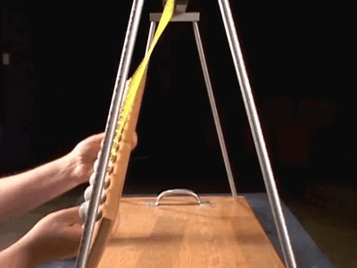

## Prologue

Humanoids liken the most chaotic natural phenomena to an aspect of themselves, in a way that they find "poetic" and "moving". 

---
00000000000000000000.000000000000000000000

The heartbeat of the universe - the song of creation began at this moment. Beating? perhaps bouncing like a ball, but it could not bounce because there was nothing to bounce against. It bounced wildly around, beating a unary drum. Perhaps there were no digits or standard positional systems when the pulsing began, perhaps it was beautifully modulated and painted primordial patterns in the halls and winding staircases - perhaps if we had measured it the wild gaps between each wave would have terrified our scientists, as each eruption brought shape to our limitless void. Unity with all, no division of matter and magic

And how did the eons pass, for they were immeasurable and unmeasured. We flew and fell, we cascaded about and our confederation filled what was not yet the planes, danced across the unshapen firmaments, glowed as all of the combined stars . And then the binary took shape, another hearbeat was heard. No not heard, how can you hear without an atmosphere and without something to hear with. It was separate but it was also us, a shadow - an echo through those same hallways and down the stairs behind us and before us at the same time, and we held ourselves tight as the dance continued

we were only the two. Then the greed of love deepened the craving, and we multiplied. The system continued diverging and creating, our components dividing and subdividing and matter was birthed - the material planes we imagined and dreamed of coalesced. Time began

---
 00000000000000000000.000000000000000000001
 
{ width=200}
{ width=200}

As more was becoming, chaos and order embraced and then fled from each other converging and fading in turn; terrifying highs and despairing lows passing through and around each other. Swirling in a breathless rush as more and more of us explosively filled the cathedral of the firmament. Out of the growth appeared the first patterns, they were more than ideas and less than physical forms. The primordials were a symphony; harmonic, discordant, and beautiful

the steady ebb and flow of photons swirling and seeking the furthest reaches of the edifice, Heliophron

<!-- "Olympus - C by James_KuKu -- https://freesound.org/s/747984/ -- License: Creative Commons 0") -->

energy passing back and forth, being shared, greedily consumed, converted and burned, Percus

<!-- "Tom 2.wav by liamamusic -- https://freesound.org/s/687330/ -- License: Creative Commons 0") -->

the crackling of protons and electrons snapping into atoms and molecules - structuring themselves and tearing themselves apart, Sibilith

<!-- "Moving Clarinet- X-Y Crossed Stereo Pair (NT-5's).wav by debudding -- https://freesound.org/s/44363/ -- License: Creative Commons 0") -->

We were the fundamentals, the quarks and the photons, we were the forces between them and the forces holding them together. Never comprehensible by any of the creatures that came to be. For their existence crossed the boundaries of the planes, and the universes. their perception was never limited by any of the various dimensions that were quantified, discussed in warm offices and freezing lecture halls. We had created everything that had come to be, not as part of a greater plan - but out of desperate *pleasure* of its existence. The primordials screamed out to each other, the universes heaved with their adoration, the pealing delight echoed throughout as a violence took hold of their kingdom. no longer greed, but hunger - howling and weeping in the desperate pleasure, tasting for the first time and desperately consuming each other

Heliophron, continually headstrong. Percus, brave and curious. Sibilith gentle and calm

---
# The Primordials

They existed before they had physical manifestations, indeed they created the very concept of time that we wish to date them with. The bodies they dreamed for each other are the foundational elements of the entirety of existence, and what one might call their consciousness exists in the primordial plane, largely unaffected by the state of matter or the passage of time. They exist in a euphoric, agonizing whorl, as they are aware of every single piece of themselves across all worlds and timelines - they hunger exclusively for the experience they can have in these forms and do not concern themselves with the goings on of their creations.

Everything exists at their behest without regard for who or what is created - as everything is a part of them, all of creation is a part of their cosmic dance together. There is no ability that could ever exist that is outside of their knowledge, there is nothing they would be unable to unmake, they ARE.

## 

There have been only 3 times that any creature has ever communicated with the primordials and it took several million years before their questions was acknowledged, and nearly a billion more before an answer was given. The portion of them that resides on the primordial plane is closest to what we might consider a body. It is a place where the energy is connected the strongest to them, and where there is not natural shape or form becuase everything is inhabited by the primordials. 

Like the patterns in the pendulums, as you continue to shift about in the chaos of the universe more patterns emerge. Those shaped by the primordials - fashioned as the foremost tools and playthings - existing first as ontological dynamics in the mathematical structures, bodiless and inevitable as the primes. Not with an atavistic nostalgia, but as a toll booth demands payment. Beings of the darkness and light. Both came forth to shape the worlds, both bowed their heads only to the creator(s). The primordials came to being as music, imprints of some reality that could not be described to immortals of these planes - and these foremost came as a door, and a   